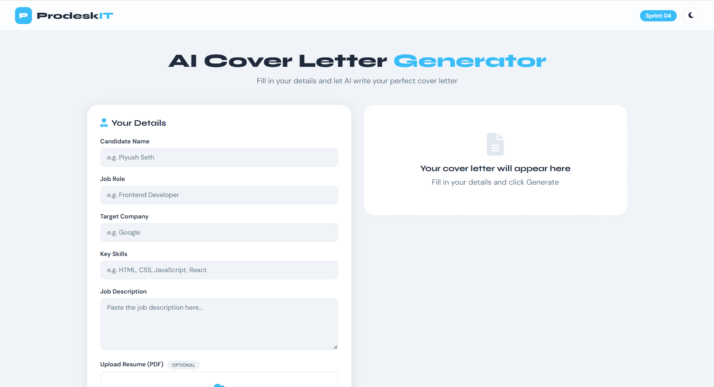

# AI Cover Letter Generator
**Sprint 04 | Software Engineer Trainee | Piyush Seth**

---

## Live Demo
https://prodesk-sprint04-3ypt.vercel.app

## Screenshot
/

## GitHub
https://github.com/piyushseth1357/prodesk-sprint04.git
## Live Video link
https://www.loom.com/share/4905cfcb414f41a3b1b747033e55df33

---

## Sprint Deliverables

### ✅ Phase 1 — Base MVP (Mandatory)
- ✅ Form — Candidate Name, Job Role, 
          Target Company, Key Skills
- ✅ Job Description input
- ✅ Template mode — interpolates state 
          variables into hardcoded string
- ✅ Cover letter rendered in dedicated UI
- ✅ Copy to Clipboard button
- ✅ Loading/Generating state

### ✅ Phase 2 — LLM Integration & Security
- ✅ Google Gemini API integrated
          (gemini-2.0-flash model)
- ✅ Prompt Engineering — state variables 
          injected into system prompt
- ✅ Security — API key stored in 
          Vercel Environment Variables
- ✅ Serverless function — api/generate.js 
          proxies Gemini API calls
- ✅ .env file created for local dev
- ✅ .gitignore configured
- ✅ "Generating..." UI state shown
          during API call

### ✅ Phase 3 — SaaS Capabilities
- ✅ PDF Resume upload — drag & drop
- ✅ PDF text extraction using PDF.js
- ✅ Resume text appended to AI prompt
- ✅ Two modes — Template & AI Generate
- ✅ Dark/Light mode toggle

---

## Tech Stack
- HTML5 — Page structure
- CSS3 — Styling, Dark mode
- Vanilla JavaScript — All logic
- Google Gemini API — AI generation
- PDF.js — Resume text extraction
- Vercel Serverless Functions — API proxy
- Environment Variables — Key security

---

## API Security Architecture
Developer
Name: Piyush Seth Role: 
Software Engineer Trainee Company: Prodesk IT 
GitHub: https://github.com/piyushseth1357/prodesk-sprint04.git
Live Site: https://prodesk-sprint04-3ypt.vercel.app
